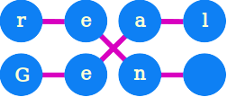

# realGA

<p align="center">
  
</p>

<p align="center">A fast and simple C++ library for Genetic Algorithms, that can be used for nonlinear constrained optimization problems.</p>


# Code Example

You can find the following code example inside examples/readme.cpp

```c++
#include <iostream>
#include "realga.h"

using namespace std;

/* Fitness function: x1^2 + x2^2 */
class QuadraticFitness : public FitnessFunction {
public:
    QuadraticFitness() {}

    float eval(const RealChromosome &g) {
        return g.gene[0]*g.gene[0] + g.gene[1]*g.gene[1];
    }
};

int main(int argc,  char** argv) {
    vector<float> LB = {-5.0, -5.0};  // Lower bound of genes
    vector<float> UB = { 5.0,  5.0};  // Upper bound of genes
    QuadraticFitness *myFitnessFunction = new QuadraticFitness();
    RealGAOptions options;
    options.setChromosomeSize(2);
    options.setPopulationSize(50);
    options.setBounds(LB, UB);
    options.setVerbose("soft");

    // Init Genetic Algorithm with options, fitness function and keepState=false
    realGA ga;
    ga.init(options, myFitnessFunction, false);

    // Init population with uniform random between LB and UB
    ga.popInitRandUniform();

    // Evolve the population for 100 times
    for (int i=0; i<100; i++) {
        ga.evolve();
    }
    // get the best score function (the minimum)
    RealChromosome best = ga.getBestChromosome();
    // Print results
    cout << "Best solution: "<< best.toString() << endl;
    cout << "Best Fitness value = " << best.fitness << endl;

    delete myFitnessFunction;
    return 0;
}
```

# Description

* $F(x)$ represents the **fitness function**, a non-linear function defined by the user. The objective is to identify the *minimum value* of this function.
* $x = (x_1, x_2, ..., x_n)$ is the input of the fitness function and is called **chromosome**
* $x_i$ is the i-th component of the chromosome $x$ is called **gene**
* $L=(l_1, l_2, ... , l_n)$ and $U=(u_1, u_2, ... , u_n)$ are the **lower** and **upper** bounds respectively of the chromosome, specifying the range within which the gene values must fall: $l_i \le x_i \le u_i$
* $P_k=\\{ x^{(1)}, x^{(2)}, ...,x^{(N)} \\}$ is the **population** at the iteration $k$, namely a set of $N$ different chromosomes $x^{(j)}$ defining a solution space at this specific iteration $k$ and evolving over time. $P_0$ is the initial population and is composed by $N$ chromosomes, that can be explicitly provided or initalized randomly.
* A **genetic algorithm** is a probabilistic optimization method employed to discover the minimum of a fitness function. It effectively addresses the following problem:

$$x^* = \arg \min_{L \le x \le U} F(x)$$


$x^*$ is the optimal solution that minimize the fitness function $F(x)$.

A genetic algorithm may struggle to converge to the true global minimum due to the inherent probabilistic nature of the method.

# Build - Linux
On terminal

```
git clone https://github.com/alenic/realGA.git
cd realGA
mkdir build
cd build
cmake -DCMAKE_BUILD_TYPE=Release ..
make
```

# Build - Windows (Visual Studio 14)


On Powershell
```
git clone https://github.com/alenic/realGA.git
cd realGA
mkdir build
cd build
cmake ..
MSBuild.exe .\realGA.sln /p:Configuration=Release
```

If you want to use Win64 compiler use the command:

```
cmake -G "Visual Studio 14 2015 Win64" ..
```

It will generates the static library **librealga.a** and the shared library **librealga_shared.so** into the folder **build/libs**

# Tests
To test realGA you can execute the **tests.bin** executable into **build/tests** folder

# Benchmarks
To perform realGA's benchmarks you can execute the **benchmarks.bin** executable into **build/benchmarks** folder

  
