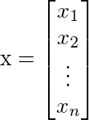
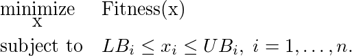

# Real Gen
Fast implementation of Genetic Algorithm for nonlinear constrained optimization problems.<br>
The **Fitness** function is a nonlinear function, defined by the user, that must be minimized.<br>
A chromosome, in this library, is simply composed by n real numbers called **genes**, then a chromosome is a real vector of dimension n, and a gene is a component of the vector.

If x is the cromosome then



x_i are the genes (for i =1,...,n). <br>

Every genes x_i are bounded by two real value: 

* LB_i <= x_i <= UB_i,  for i = 1,...,n.

A **genetic algorithm** is a probabilistic method for find the minimum of the Fitness function, and it solves the problem



See the <a href='docs/index.md'>documentations</a> for more informations.

## Install

Download the repository with the command

```
git clone https://github.com/alenic/realGen.git
```

Create the forlder build for cmake:

```
cd realGen
mkdir build
cd build
```

Use CMake to compile it:

### Windows (Visual Studio 14)

```
cmake ..
MSBuild.exe .\realGen.sln /p:Configuration={Release|Debug}
```

If you want to use Win64 compiler use the command:

```
cmake -G "Visual Studio 14 2015 Win64" ..
```

### Linux

```
cmake -DCMAKE_BUILD_TYPE={Release|Debug} ..
make
```

# Quick start

You can find the following code example inside examples/readme.cpp

```c++
#include <iostream>
#include "realgen.h"
#include "fitnessfunction.h"

using namespace std;

/* Fitness function: x1^2 + x2^2 */
class QuadraticFitness : public FitnessFunction {
public:
    QuadraticFitness() {}

    double eval(const RealGenotype &g) {
        return g.gene[0]*g.gene[0] + g.gene[1]*g.gene[1];
    }
};


int main(int argc,  char** argv) {
    vector<float> LB = {-5.0, -5.0};  // Lower bound of genes
    vector<float> UB = { 5.0,  5.0};  // Upper bound of genes
    QuadraticFitness *myFitnessFunction = new QuadraticFitness();
    RealGenOptions options;
    options.setChromosomeSize(2);
    options.setPopulationSize(50);
    options.setBounds(LB, UB);

    // Define RealGen(Population size, number of genes in a chromosome, LB, UB)
    RealGen ga(options);
    ga.setFitnessFunction(myFitnessFunction);
    ga.setVerbose(true);

    // Init population with uniform random
    ga.initRandom();
    // Evolve the population for 100 times
    for (int i=0; i<100; i++) {
        ga.evolve();
    }
    // get the best score function (the minimum)
    RealGenotype best = ga.getBestChromosome();
    // Print results
    cout << ga.populationToString(); // print all the population
    cout << "Best solution: "<< best.toString() << endl;
    cout << "Best Fitness value = " << best.fitness << endl;

    delete myFitnessFunction;
    return 0;
}

  ```
  
Compile with
  ```
  g++ -std=c++11 -I$(REALGEN_INCLUDE_FOLDERS) -o readme.bin readme.cpp $(REALGEN_LIB_FOLDER)/librealgen.a
  ```
  

