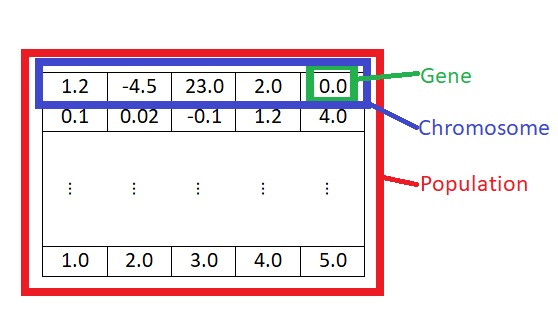

# Real Gen (Genetic Algorithm for numerical real type genes)
Real Gen was born for solves bound constrained minimization problems applied to AI (Artificial Intelligence) bots.
This is a fast implementation focuses only on real genotype, it means that a **solution** of the problem must be an N-dimensional array of **float** numbers (x_1, x_2, ... , x_n)

The following picture introduce the terminology of genetic algorithms

## Table of contents

  * <a href='install.md'>Install</a>

  * <a href='quick_start.md'>Quick start</a>

  * <a href='genetic_operators.md'>Genetic Operators</a>
  > Examples:
  > * <a href='genetic_operators.md'>Simple quadratic function</a>
  > * <a href='genetic_operators.md'>Passing parameters to a fitness function</a>
  > * <a href='genetic_operators.md'>Multithread example</a>
  > * <a href='genetic_operators.md'>Advanced options</a>
